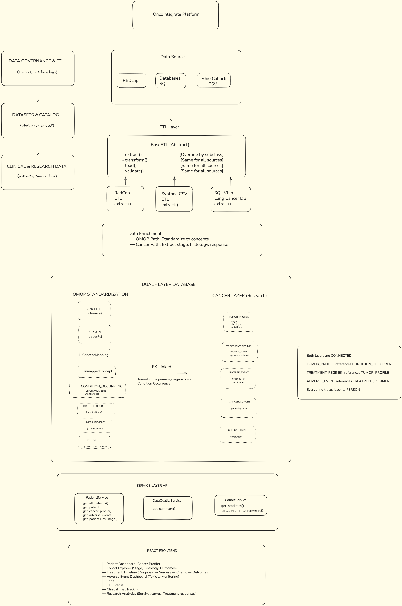
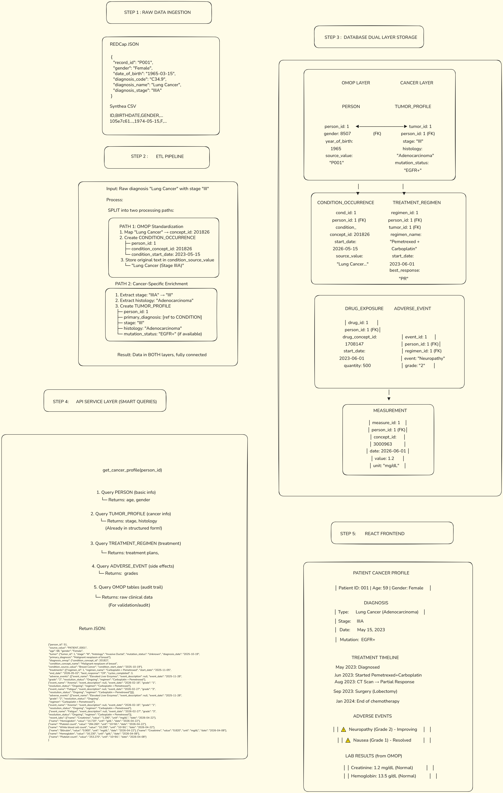
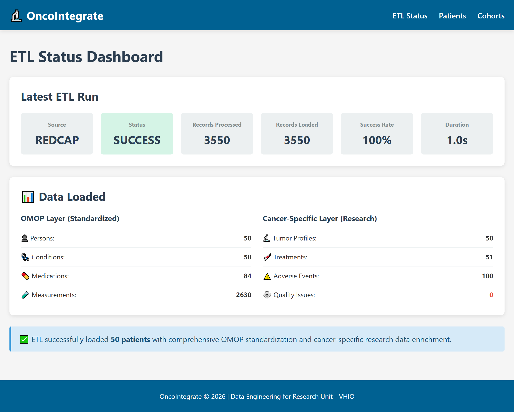
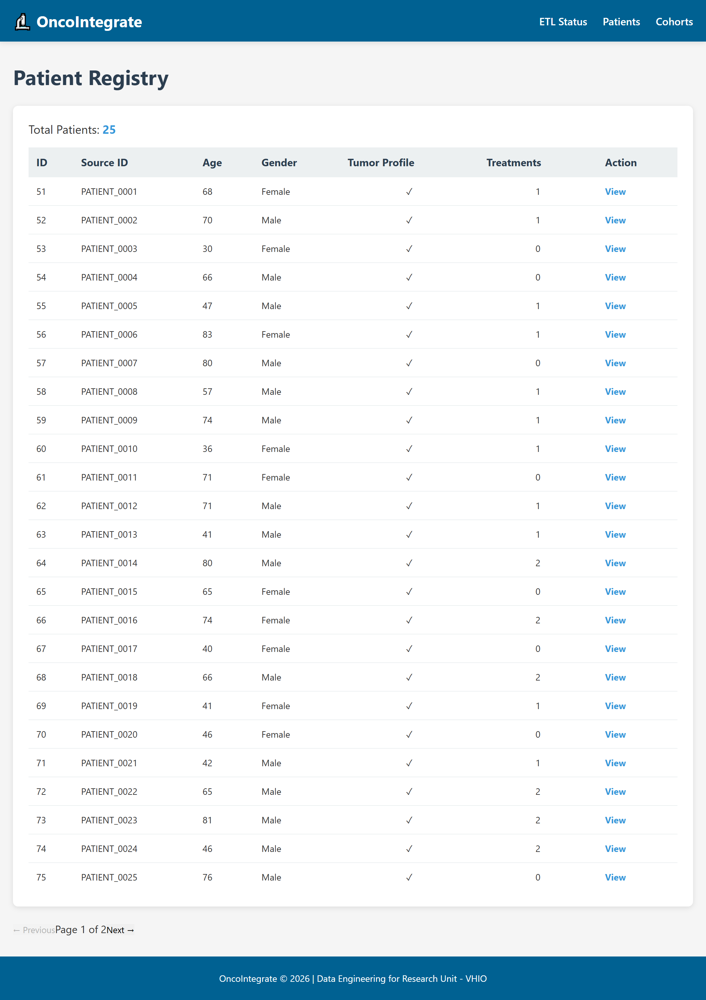
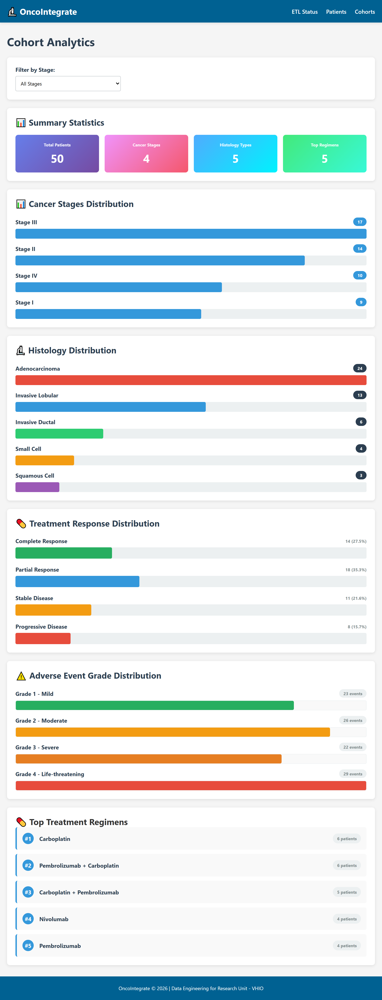
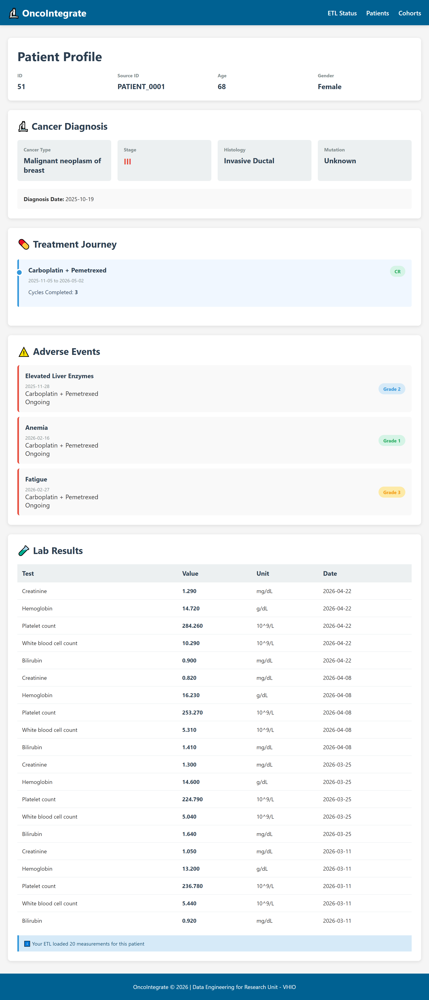

# OncoIntegrate

A comprehensive oncology research data platform combining OMOP standardization with cancer-specific clinical insights.

## Architecture

The following diagram illustrates the overall architecture of OncoIntegrate,
from data ingestion through ETL, dual-layer storage, service APIs, and the
research dashboard.

## Data Flow

A detailed explanation of how data moves through the platform,
including ETL transformation, OMOP standardization, and cancer-specific
enrichment, can be found in

### ETL Layer
- REDCap eCRF data extraction
- OMOP concept mapping & standardization
- Cancer-specific data enrichment
- Data quality validation & logging

### Backend
- Django REST Framework
- Service layer pattern
- Optimized database queries (select_related, prefetch_related)
- PostgreSQL with strategic indexes

### Frontend
- React 18 + Vite
- React Router (createBrowserRouter)
- React Query for data fetching
- CSS Modules for styling
- Responsive design

### Database
- Dual-layer design:
  - **OMOP Layer**: Standardized clinical data
  - **Cancer-Specific Layer**: Research-focused oncology data

## Quick Start

### Docker (Recommended)

docker-compose up
# Frontend: http://localhost:3000
# Backend: http://localhost:8000

### Local Development

# Backend
python manage.py runserver

# Frontend (in separate terminal)
cd frontend && npm run dev

## API Documentation

See `api_docs.py` for complete endpoint documentation.

## Performance Optimizations

- ✅ Query optimization with prefetch_related/select_related
- ✅ Database indexes on frequently queried fields
- ✅ Pagination (25 records per page)
- ✅ React Query caching
- ✅ Lazy loading of lab results (max 20 per patient)

## Data Schema

### OMOP Layer (Standardized)
- Person
- Concept (SNOMED/ICD/LOINC mappings)
- ConditionOccurrence
- DrugExposure
- Measurement
- VisitOccurrence

### Cancer-Specific Layer (Research)
- TumorProfile (stage, histology, mutations)
- TreatmentRegimen (regimen, response, cycles)
- AdverseEvent (toxicity, grade, resolution)
- ClinicalTrial
- CancerCohort

  
## Screenshots

